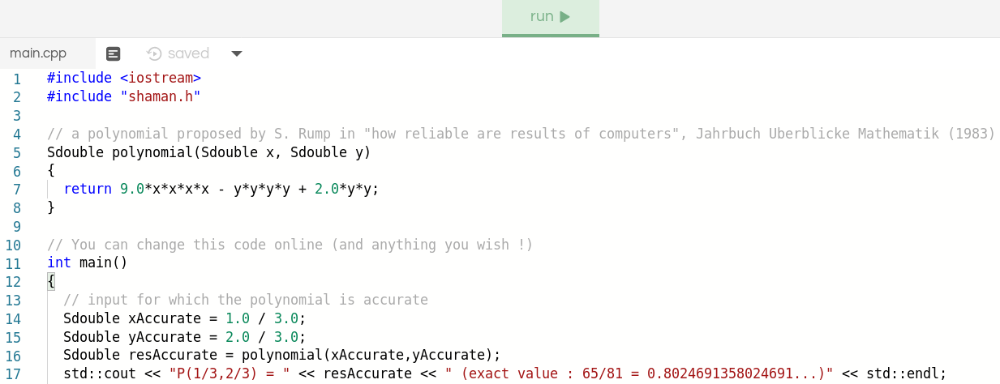

# SHAMAN : A library that bridges the gap between humans and the invisible world of numerical errors

Shaman is a C++11 library that use operator overloading and a novel method to evaluate the numerical accuracy of an application.

It has been designed to target high-performance simulations and, thus, we insured that it is not only accurate but also:
- fast enough to be tested on very large simulations[^1]
- compatible with all of C++ mathematical functions
- threadsafe and compatible with both OpenMP and MPI

[^1]: As numerical error is more likely to appears when large number of operations are in play.

## Usage

Once Shaman is compiled and linked to your project (see the **Installation** section below), you just need to `#include <shaman.h>` and replace your floating point datatypes (`float`, `double`, `long double`) with their Shaman equivalents (`Sfloat`, `Sdouble`, `Slong_double`):

```cpp
#include <shaman.h>

Sdouble largeNum = 1e30;
Sdouble smallNum = 1;
Sdouble sum = (largeNum + smallNum) - largeNum; // should be 1

std::cout << "result as displayed by shaman: " << sum << '\n' // notice that Shaman displays only significant digits
          << "result that would have been obtained without Shaman: " << sum.number << " == " << static_cast<double>(sum) << '\n'
          << "approximation of the numerical error: " << sum.error << '\n'
          << "approximation of the number of significant digits: " << sum.digits() << std::endl;
```

Mathematical functions are defined in the `Sstd` namespace, additional traits and definitions can be included from the headers in the `shaman/helpers` folder to help when using MPI, Eigen or Trilinos.

### Mixed precision operations

Shaman insures that implicit cast are done as they would have been done by their underlying types.

However, similarly to `std::complex`, some mixed precision operation that are legal with the original types might be rejetted by their intrumented equivalent in the absence of an explicit cast (such as `Sfloat(1.5f) + double(1.5)`).
To solve the problem, one just need to add an explicit cast.

## Installation

### Compiling Shaman

To compile Shaman, open a shell and run :

```
cmake -DCMAKE_INSTALL_PREFIX=PREFIX .
make install
```

Where `PREFIX` is the path to your desired instalation folder.

You can add the `SHAMAN_ENABLE_TAGGED_ERROR` flag to enable tagged error (or the `SHAMAN_TAGGED_ERROR` compilation flag if you use make).

### Linking Shaman with Cmake

To insure that cmake load Shaman, add `find_package(shaman)` to the top of your `CMakeLists.txt` file.

To link the library, add `PUBLIC shaman::shaman` to the end of your `target_link_libraries` line.

You might also need to set the `shaman_DIR` variable (with the path to Shaman's autogenerated cmake files) if Shaman's instalation folder is not known to cmake.

Don't forget to enable Fused-Multiply-Add at compilation (`-mfma`), otherwise some operations (`*`, `/`, `sqrt`) will be much slower.

Use the `SHAMAN_UNSTABLE_BRANCH` flag to enable the count and detection of unstable branches.
The `Shaman::displayUnstableBranches` function can then be used to print the number of unstable tests performed by the application (and additional localisation informations if tagged error is activated).

## Try it online

Click below to try Shaman online:

[](https://repl.it/@nestordemeure/ShamanDemo?lite=true)

See our `examples` folder for further illustrations of typical use cases.

## How does Shaman works ?

Shaman overloads operations to run a first order model of the propagation of numerical error in your code.
Having both numbers and a good approximation of their numerical error, we can deduce their number of significant digits and signal unstable tests:

The numerical error produced by a single operation is deduced using an Error Free Transformation for arithmetic operators and higher precision arithmetic for arbitrary mathematical functions.
Once the local numerical error has been computed, it is propagated in the rest of the computation using basic arithmetic.

It is important to note that Shaman follows the same control flow as the uninstrumented code.
This means that, while Shaman can signal that higher precision code would have taken a different branch, it will follow the original branch.
This can lead Shaman to underestimate the numerical stability of codes that have been designed to be resilient to numerical error in intermediate steps.
Hence, when Shaman indicates that a result has few/no significant digits, you should always check wether it has detected unstable branches to confirm the result.

## References

The inner workings of shaman will be detailed in an [upcoming paper]().

